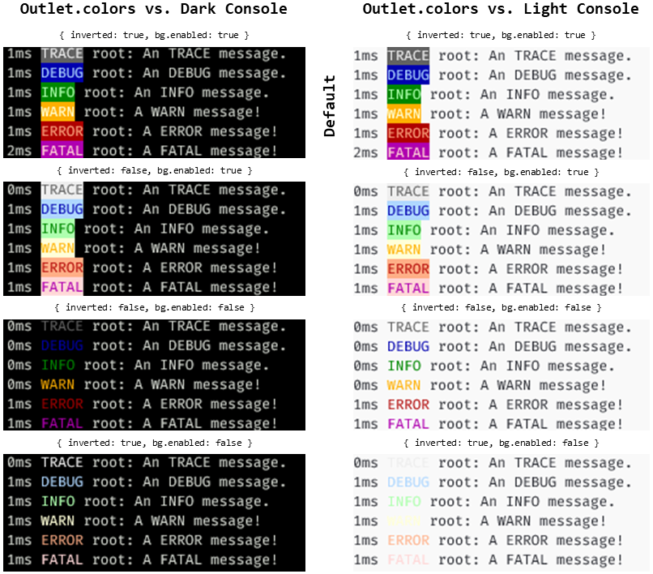
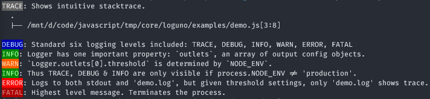
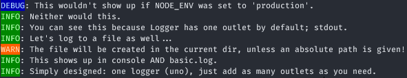
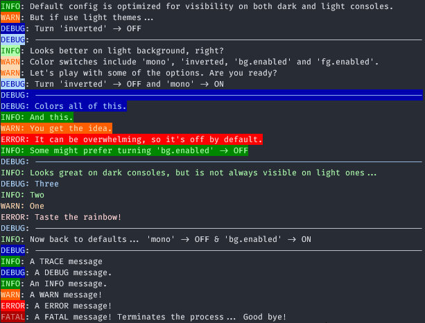
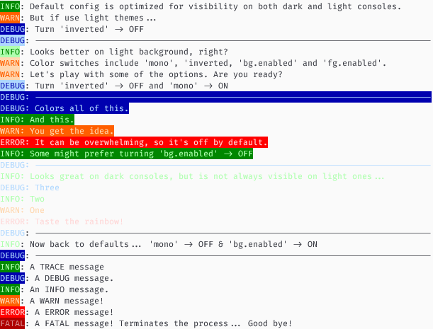
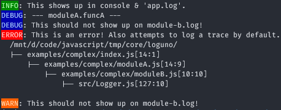
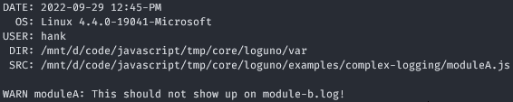
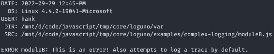

# js-loguno

Log beautiful messages easily.

[](https://www.npmjs.com/package/loguno)
[](https://npmcharts.com/compare/loguno?minimal=true)

**Features:**

- Simple design: one Logger (uno!), many outlets (no need to instantiate anything!)
- Stack traces shown in the tree format our brain expects
- Method names follow the sane convention of specifying an action,
  i.e. ``logInfo`` (verb :arrow_right: function) and NOT ``info`` (noun :arrow_right: property)
- Default colors work on dark & light consoles alike

  

:thumbsdown:? Please [tell me](https://github.com/hankadler/js-loguno/issues) why.

:heart:? I'd relish an [expresso](https://www.patreon.com/user?u=80437116) :coffee:!

## Table of Contents

- [Setup](#setup)
- [Examples](#examples)
- [Docs](#docs)
- [License](#license)

## Setup

```bash
npm i loguno
```

:warning: ``loguno`` is an ES package. It only works on projects whose ``package.json`` specify the
``"type": "module"`` property.

## Examples

```js
import Logger from "loguno"; // Logger has one outlet by default; stdout

Logger.logTrace("Shows intuitive stacktrace.");
Logger.logDebug("Standard six logging levels included: TRACE, DEBUG, INFO, WARN, ERROR, FATAL");
Logger.logInfo("Logger has one important property: `outlets`, an array of output config objects.");
Logger.logWarn("`Logger.outlets[0].threshold` is determined by `NODE_ENV`.");
Logger.logInfo("Thus TRACE, DEBUG & INFO are only visible if process.NODE_ENV != 'production'.");

// let's hide TRACE, DEBUG and INFO from stdout...
Logger.outlets[0].threshold = Logger.LEVELS.WARN;

// and let's add another all-inclusive outlet pointing to file 'demo.log'
Logger.addOutlet("demo.log", {
  isExclusive: false, // so it receives messages originating from modules other than this one
  threshold: Logger.LEVELS.TRACE, // so it shows all messages
  template: Logger.TEMPLATES.dlnm // so format -> {duration} {level} {name} : {message}
});

Logger.logError(
  "Logs to both stdout and 'demo.log', but given threshold settings, only 'demo.log' shows trace."
);

Logger.logFatal("Highest level message. Terminates the process.");
```

- stdout
  
  

### More Examples

```bash
git clone https://github.com/hankadler/js-loguno loguno

npm i

# so node works fine with ES modules, consider adding to ~/.bashrc
export NODE_OPTIONS='--experimental-specifier-resolution=node'
export NODE_NO_WARNINGS='1'
```

[basic-logging](examples/basic.js)
  
- stdout
  
  
  
- basic.log
  
  

[change-colors](examples/changeColors.js)

- stdout

  
  
  

[complex-logging](examples/complex)

- stdout

  

- app.log

  

- module-a.log

  

- module-b.log

  
 
## Docs

Logger structure:


Outlet [defaults](src/constants/DEFAULTS.js)

## License

[MIT](LICENSE)
